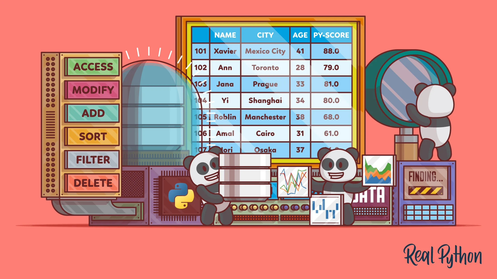

# Veri Analizi - Pandas

Bu repository, Python'da veri analizi yapmak için kullanılan **Pandas** kütüphanesine yönelik ders notları ve uygulamaları içermektedir. Aşağıda, her bir konu başlığı ve içeriği detaylı bir şekilde açıklanmıştır.

##  English description below 👇🏻🌐

---

## 1 Pythonda Pandas Kütüphanesi Nedir?
- Pandas kütüphanesinin temel tanımı.
- Veri analizi için sağladığı avantajlar.
- Pandas'ın temel veri yapıları: **Series** ve **DataFrame**.

---

## 2 Pythonda Pandas Serileri

- Series yapısının tanımı ve özellikleri.
- Series oluşturma ve temel işlemler.
- Series üzerinde veri manipülasyonu.

---

## 3 Pythonda Pandas DataFrame Tanımlamaları

- DataFrame yapısının tanımı ve kullanımı.
- DataFrame oluşturma yöntemleri (sözlükler, listeler vb.).
- DataFrame özelliklerine erişim.

---

## 4 Pythonda Pandas ile Farklı Dosya Tiplerinden Veri Okuma
- CSV, Excel, JSON gibi dosya formatlarından veri okuma.
- Pandas ile dosya yazma işlemleri.
- Dosya formatlarına uygun veri işlemleri.

---

## 5 Pandas DataFrame ile Satır Sütun Seçimleri

- **loc** ve **iloc** kullanımı.
- Satır ve sütun seçme, filtreleme işlemleri.
- Veri düzenleme teknikleri.

---

## 6 Pandas DataFrame ile Filtreleme

- Şartlı ifadelerle filtreleme.
- Çoklu koşullar kullanarak veri seçimi.
- Boolean dizilerle çalışma.

---

## 7 Uygulama - IMDb Filmlerinin Veri Analizi

- IMDb datasetinde temel veri analizi.
- Filmlerin puan ve tür bazında incelenmesi.
- Görselleştirme için temel yöntemler.

---

## 8 Pandas DataFrame ile Groupby Kullanımı

- **groupby** ile veri gruplama ve özetleme.
- Toplam, ortalama, medyan gibi istatistiksel fonksiyonlar.
- Çoklu gruplama işlemleri.

---

## 9 Pandas ile Kayıp ve Bozuk Veri Analizi

- Kayıp veri tespiti ve doldurma.
- **fillna**, **dropna** gibi metotların kullanımı.
- Eksik verilerle başa çıkma yöntemleri.

---

## 10 Pandas ile String Fonksiyonları Kullanımı

- String işlemleri için kullanılan metotlar.
- Veriler üzerinde düzenleme ve temizleme.
- String bazlı filtreleme örnekleri.

---

## 11 Pandas ile Join ve Merge

- DataFrame birleştirme yöntemleri: **merge**, **join**, **concat**.
- Farklı veri kaynaklarını birleştirme.
- İlişkisel veri analizi örnekleri.

---

## 12 Pandas ile DataFrame Metotları

- Öne çıkan DataFrame metotları: **apply**, **map**, **sort_values**.
- Veri üzerinde hızlı manipülasyon.
- Metotlarla veri özetleme ve analiz.

---

## 13 Uygulama - NBA Oyuncularının Veri Analizi

- NBA oyuncu istatistikleri üzerinde analiz.
- Performans değerlendirme ve veri görselleştirme.
- Grup bazında oyuncu karşılaştırmaları.

---

## 14 Uygulama - YouTube İstatistik Verilerinin Analizi

- YouTube videolarının izlenme, beğeni, yorum analizi.
- Zaman bazlı analizler ve trend çıkarımları.
- Verilerin görselleştirilmesi.

---

## Kullanım Talimatları
- Tüm konular ve uygulamalara ait notlar, **.ipynb** dosyası olarak yer almaktadır.
- Kod örneklerini çalıştırmak için Jupyter Notebook veya Google Colab kullanabilirsiniz.
- Kodun düzgün bir şekilde çalışabilmesi için zip içerisinde bulunan veri setinin .ipynb uzantılı dosya ile aynı konuma ayıklanmalıdır.

## Katkıda Bulunun
Bu repo sürekli güncellenmektedir. Siz de katkıda bulunmak isterseniz pull request açabilirsiniz!

---

**Proje Sahibi:** Aybala Kılıç

**İletişim:** [GitHub Profilim](https://github.com/aybalakilic)

# 🌐  Data Analysis - Pandas

This repository contains lecture notes and applications related to the **Pandas** library, which is used for data analysis in Python. Below, each topic and its content are explained in detail.

---

## 1 What is the Pandas Library in Python?
- Basic definition of the Pandas library.
- Advantages of using Pandas for data analysis.
- Core data structures of Pandas: **Series** and **DataFrame**.

---

## 2 Pandas Series in Python

- Definition and features of the Series structure.
- Creating Series and performing basic operations.
- Data manipulation on Series.

---

## 3 Pandas DataFrame Definitions in Python

- Definition and usage of the DataFrame structure.
- Methods for creating DataFrames (dictionaries, lists, etc.).
- Accessing DataFrame properties.

---

## 4 Reading Different File Types with Pandas in Python
- Reading data from file formats such as CSV, Excel, and JSON.
- Writing files using Pandas.
- Data operations suitable for file formats.

---

## 5 Selecting Rows and Columns with Pandas DataFrame

- Using **loc** and **iloc**.
- Selecting and filtering rows and columns.
- Data editing techniques.

---

## 6 Filtering with Pandas DataFrame

- Filtering using conditional statements.
- Selecting data with multiple conditions.
- Working with boolean arrays.

---

## 7 Application - IMDb Movie Data Analysis

- Basic data analysis on the IMDb dataset.
- Examining movies based on ratings and genres.
- Basic methods for visualization.

---

## 8 Groupby Usage with Pandas DataFrame

- Grouping and summarizing data with **groupby**.
- Statistical functions like total, average, and median.
- Multi-level grouping operations.

---

## 9 Missing and Corrupted Data Analysis with Pandas

- Detecting and filling missing data.
- Using methods like **fillna** and **dropna**.
- Handling missing data effectively.

---

## 10 Using String Functions with Pandas

- Methods used for string operations.
- Cleaning and editing data.
- Examples of string-based filtering.

---

## 11 Join and Merge with Pandas

- Methods for merging DataFrames: **merge**, **join**, **concat**.
- Combining different data sources.
- Examples of relational data analysis.

---

## 12 DataFrame Methods with Pandas

- Key DataFrame methods: **apply**, **map**, **sort_values**.
- Quick data manipulation.
- Summarizing and analyzing data using methods.

---

## 13 Application - NBA Players Data Analysis

- Analyzing NBA player statistics.
- Performance evaluation and data visualization.
- Comparing players based on groups.

---

## 14 Application - YouTube Statistics Data Analysis

- Analysis of YouTube videos' views, likes, and comments.
- Time-based analysis and trend extraction.
- Visualization of data.

---

## Usage Instructions
- Notes for all topics and applications are provided as **.ipynb** files.
- To run the code examples, use Jupyter Notebook or Google Colab.
- To ensure the code works properly, extract the dataset provided in the zip file to the same location as the .ipynb file.

## Contribute
This repository is constantly being updated. If you'd like to contribute, feel free to open a pull request!

---

**Project Owner:** Aybala Kılıç

**Contact:** [My GitHub Profile](https://github.com/aybalakilic)

